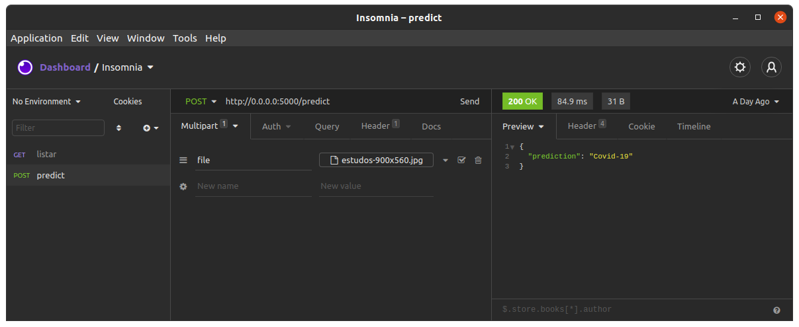

# detectorcovidxray
Detector de Covid com exame de diagnóstico por imagem - Raio X

As imagens de Raio X

Foi utilizado a Resnet101 com os pesos treinados e congelados, somente a camada de saida foi adaptada ao ploblema, apesar de poucas epocas de treinamento o resultado foi razoavel, como são poucas imagens utilizar uma validação cruzada ajudaria a prever se o modelo esta realmente com bons resultados, apesar disso e melhor um conjunto com milhares de imagens para aumentar a precisão do modelo.

API with Flask

 <h3>Como usar com o Docker<h3>
    
 `git clone https://github.com/carlsec/detectorcovidxray.git`
   
 `docker build -t python-docker .`
    
 `docker run python-docker`

    
<h6>Coloque o arquivo .pth dos pesos treinados na raiz do directorio. </h6>

<h4 align="center">
    <a href="https://drive.google.com/file/d/1MBwHhK0yaosXjfEBf_YQGJAF39-aROI-/view?usp=sharing">🔗 Pesos do modelo treinado</a>
</h4>

🚀 Faça o Download no Google Drive

<h4 align="center">
    <a href="https://www.kaggle.com/imranzaman5202/covid19-xray-images-dataset">🔗 Dataset</a>
</h4>

🚀 Veja mais detalhes das imagens no Kaggle

